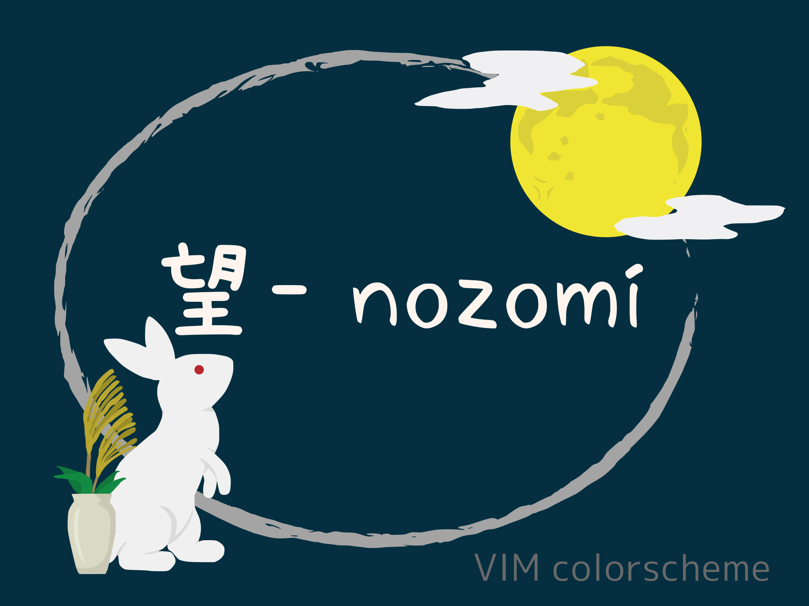
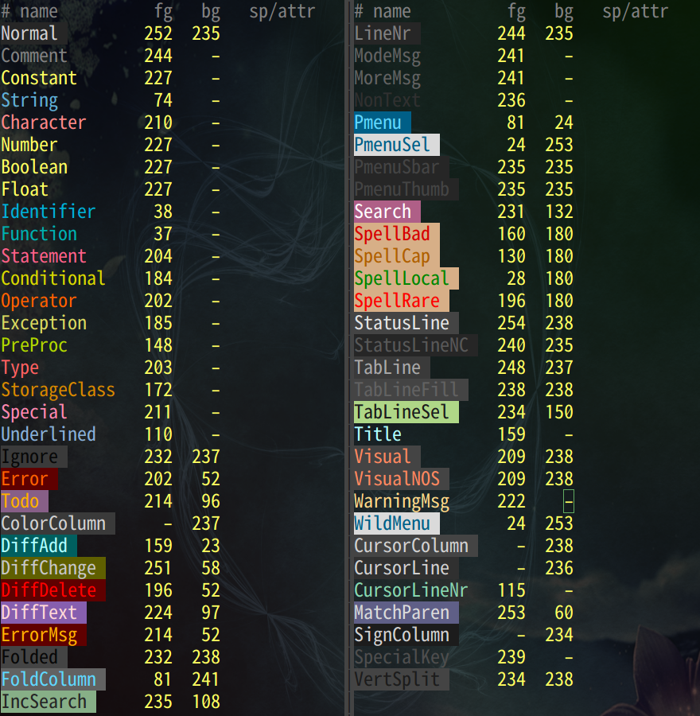
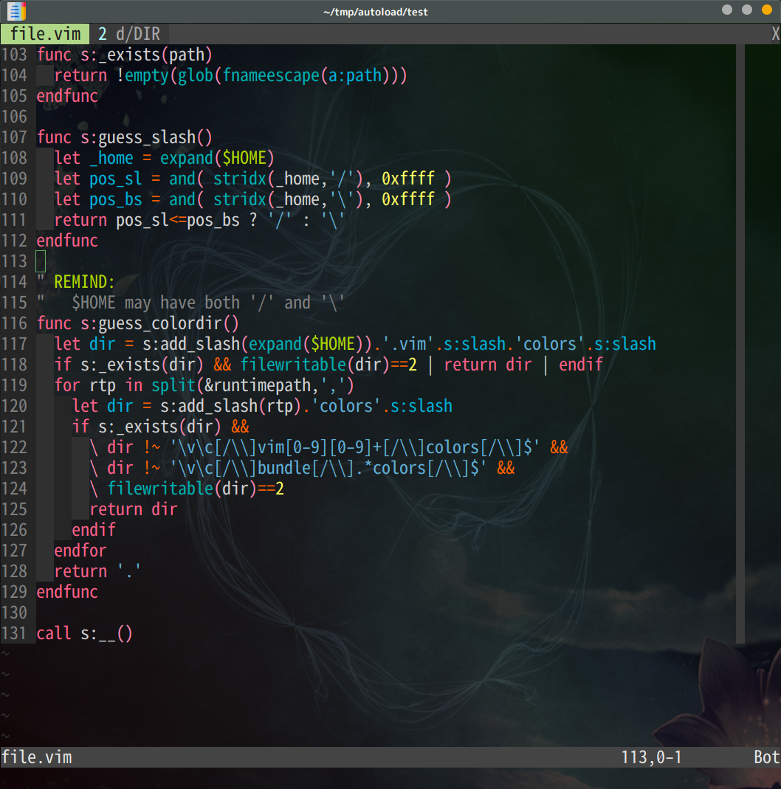
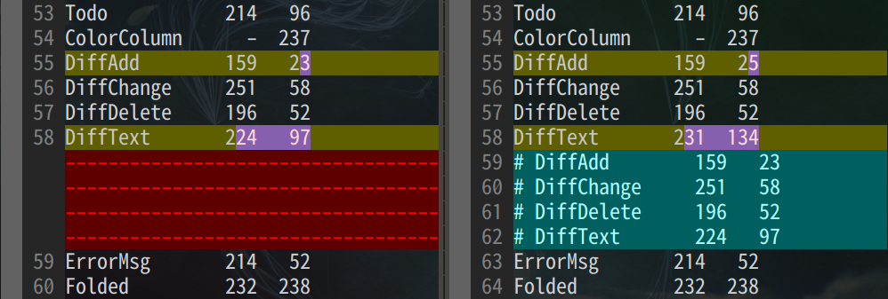
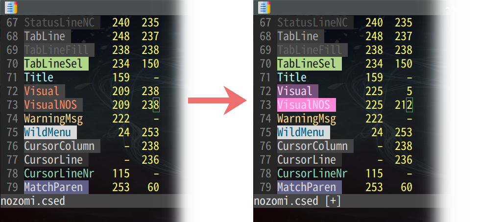

# vim-nozomi :full_moon:
<p align="center"></p>

## Introduction

A dark but colorful and midium brightness colorscheme for VIM.  
It has 256 and true colors support both terminal and GUI.

Nozomi means hope and is suggestive of full moon in Japanese.

## Colors


## Installation

Manual:

```sh
git clone https://github.com/nokobear/vim-nozomi
cp vim-nozomi/colors/nozomi.vim ~/.vim/colors/
```

OR  
Use a package manager like vim-plug.

Using [vim-plug](https://github.com/junegunn/vim-plug):

```vim
Plug 'nokobear/vim-nozomi'
```

## Screenshots

vimscript



diff



## Customization

Edit `./colors/nozomi.vim`.

OR  
Nozomi is created with [vim-colorscheme-edit](https://github.com/nokobear/vim-colorscheme-edit).  
Edit `./src/nozomi.csed` with this plugin.



## Misc

### for vim-airline plugin

Nozomi doesn't have vim-airline-theme, but I feel `bubblegum` or `wombat` is
well matched.

```vim
let g:airline_theme = 'bubblegum'
" or
let g:airline_theme = 'wombat'
```
